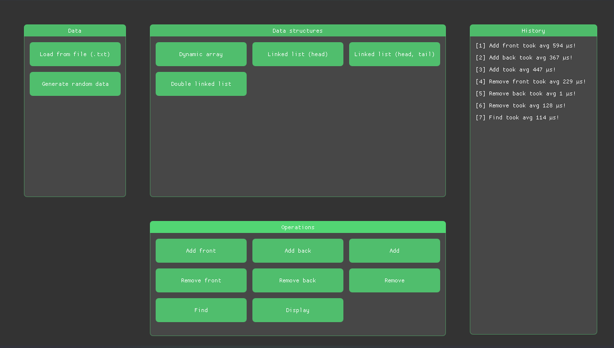

## Data structures analysis GUI

> C++ GUI for time analysis of algorithms/data structures based on ImGui with Catch2 tests


## Preview


## Implemented data structures/algorithms
- Dynamic Array
- Linked List (with/without tail)
- Double Linked List
- Max Heap Priority Queue
- BST Priority Queue


## Run Locally

Run project
```bash
make && ./gui
```

Clean project
```bash
make clean
```

Run tests
```bash
g++ -o test [/structure.cpp] ../utils.cpp -std=c++17 && ./test
```

## License

[MIT](LICENSE.md)


## Feedback

If you have any feedback, feel free to reach out adam.makarewicz14@gmail.com
