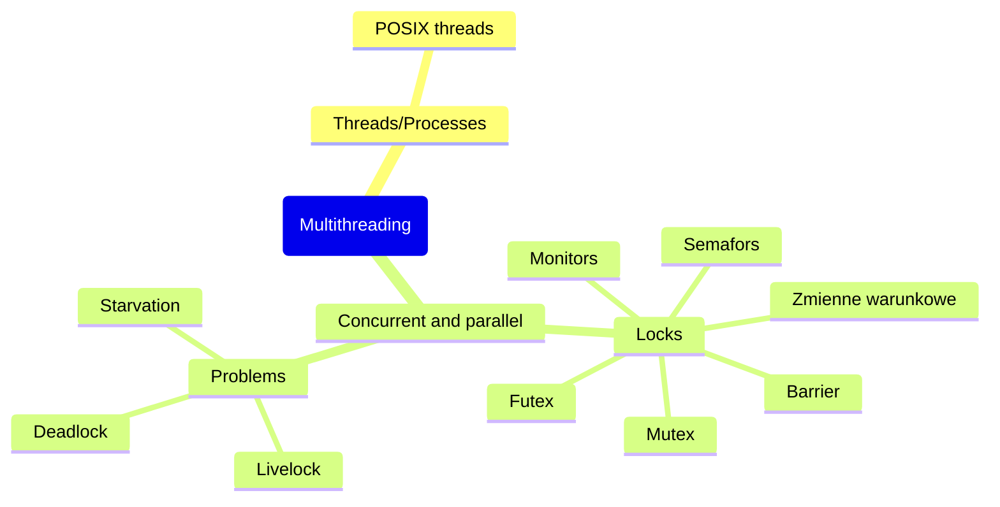

## Threads/Processes

**Wątek** to wydzielona część programu wykonywana współbieżnie w ramach procesu.

- LWP (lightweight process)
- Wątek główny i poboczny
- Posiada unikalny identyfiaktor (`TID`)
- Komunikacja między wątkami jest szybsza
- Tworzenie oraz przełączanie kontekstu jest szybsze


**Proces** wykonują programy, są "jednostką zasobów", wątki są "jednostką" kodu/wykonania

- Procesy nie współdzielą przestrzeni adresowej, za to wątki współdzielą przestrzeń adresową (poza stosem) oraz większość innych zasobów procesu
- Posiada unikalny identyfiaktor (`PID`)


**Green threads** są zarządzane w ramach maszyny wirtualnej, a nie przez system operacyjny

- Możliwość użycia w systemach niewspierających wielowątkowści
- Często nie mogą korzystać z równoległości
- Łatwiejsze tworzenie i synchronizacja, lecz mniej stabilna wydajność
- Przeciwieństo wątków natywnych (zarządzanych przez SO)


### **User-space models**

- One-to-one - każdy wątek użytkownika na osobym wątku systemowym
- Many-to-one - wiele wątków użytkownikan a tym samym wątku systemowym
- Many-to-many - n wątków użytkownika na m wątkach systemowych


### POSIX threads

#### Creation

```c
int pthread_create(
	pthread_t *id, 
	const pthread_attr_t *attr, 
	void * (*func) (void*)
	void * arg
)
```


1. Wskaźnik na miejsce gdzie zachować identyfikator/uchwyt wątku. Potrzebny do dolaszego odwołania się do utworzonego wątku
2. Wskaźnik na strukturę atrybutów wątku (domyślnie ustaw na NULL)
   Typ wątku: joinable (domyślnie) lub detached
   Adres stosu: ustalony przez system (domyślnie) lub własny
   Rozmiar stosu: 96 kB oraz obszar ochrony za stosem
   Typ oraz paramtery strategii szergowania
3. oraz 4. to kolejno wskaźnik na funkcję do uruchomenia w nowym wątku oraz arguemnty przekazywane do funkcji wątku

#### Ending

- Jawne wywołanie `pthread_exit((void *)42)` (zwraca status 42)
- Anulowanie wątku `pthread_cancel()`
- Którykolwiek wątek wykona `exit()`
- Wątek głowny wyjdzie z main()

Zakończenie wszystkich wątków kończy proces

#### Joining

`pthread_join()` czeka na zakończenie podanego wątku i zapisuje jego kod powrotu

- Odpowiednik proceswego `wait()`
- Wątek musi być joinable
- Join na już "zjoinowanym" wątku stanowi niezdefiniowane zachowanie
- Wiele jodnoczesncyh joinóœ stanowi niezdefiniowane zachowanie (wyścig)
- Wątki zombie

#### Detaching

`pthread_detach()` zwraca zasoby automatycznie po zakończeniu, przeciwieństwo joinable. 

- Przenosi wątek w stan `detached`
- Generalnie dla kązdego wątku utworzonego `pthread_create()` powinno się ostatecznie wywołać `pthread_join()` lub `pthread_detach()`
- Koniec procesu zwalnia wszystkie zasoby - brak wycieków

#### Canceling

`pthread_cancel()` wysyła żądanie anulowania do wątku (i od razu zwraca)

- Stan anulowania działa jak maska
  - włączony (domyślnie)
  - wyłączony (do ustawienia przez `pthread_setcancelstate()`) - żądanie zakolejkowane aż stan będzie włączony
- Typ anulowania:
  - deferred - anulowanie nastąpi przy najbliższym tzw. punckie anulowania
  - asynchronous - anulowanie natychmiast

## Concurrency vs parallelism


**Sekcja krytyczna** to fragment kodu korzystający z zasobu dzielonego, którego wykonanie przez wiele wątków musi być ograniczone.

- Musi być atomowa (wykona się cała lub nie wykona się wcale)
- Sekcję krytyczną możę wykonywać jeden wątek naraz
- Problem spójności występuje zarówno przy zapisie jak i odczyccie ("brudny odczyt", CPU cache)
- Szczególnie widoczny w przypadku modyfikacji całych struktur lub obiektów
- Występuje też przy modyfikacji pojedynczej zmiennej, nawet boolowskiej; to
  czy zostanie to zrobione pojedynczą instrukcją zależy od architektury i implementacji.
- Zbyt krótka (ale też zbyt długa!) sekcja krytyczna może być błędna.
- Zbyt długa sekcja może być niewydajna (ogranicza współbieżność/równoległość).
- Spójność jest ważniejsza niż wydajność!
- Chcemy wejść do sekcji najszybciej jak to możliwe - inaczej opóźniami wykonanie kodu
- Czekanie na semaforze/mutexie jest koniecznym, lecz niepożądanym efektem implementacji oraz obecności innych wątków

### The structure of a typical process in concurrent programming

1. Entry section - proces wskazuje zamiar wejścia do sekcji krytycznej
2. Critical section - część kodu, w której uzyskuje się dostęp do współdzielonych zasobów. Kluczowe jest zapewnienie wzajmenego wykluiczenia w tej sekcji, aby uniknąć wyścigu
3. Remainder section - kod spoza sekcji krytycznej, w której proces wykonuje inne zadania. Nie obejmuje wykluczenia itd.
4. Exit section - proces wskazuje, że zakończyl wykonywanie sekcjii krytycznej.

### Problems of concurrent programming

- Problem spójności danych
- Problem zagłodzenia
- Problem zakleszczenia
  - Livelock


Synchronizacja wątków wymuszenie zależności czasowych pomiędzy czynnościami dwóch lub więcej wątków. Synchronizacja i komunikacja to nie to samo.

- Zależność może być wprost (jednoczesne rozpoczęcie czynności) lub "odwrotna" (jeden proces zaczyna czynność gdy inny jakąs kończy)
- Synchronizacja korzysta z komunikacji
- Komunikacja może być synchroniczna lub asynchroniczna
- Blokowanie jest nieodłącznym elementem poprawnej synchronizacji


**Wywłaszczenie** to proces przerwania aktualnie wykonywanego wątku w celu umożliwienia wykonania innego wątku

### Locks

Mechanizm synchronizacji oraz ADT/struktura danych kontrolująca dostęp do zasobu (sekcji krytycznej).

- Mogą być obowiązkowe lub opcjonalne
- Blokada może opierać się na ciągłym sprawdzaniu stanu (polling) lub na blokowaniu do czasu zwolnienia zasobu
- Konieczne zapewnienie atomowości

#### Semafors

Licznik oznaczający liczbę wolnych egzemplarzy zasobu

- Atomowa operacja zajęcia (wait, lock, acquire, down, P) - czekaj dopóki licznik dodatni, po czym zmniejsz licznik
- Atomowa operacja zwolnienia (signal/post, unlock, release, up, V) - zwiększ licznik

- Semafory binarne lub zliczajace
- Semfory anonimowe lub nazwane
- Semafor może zostać zwolniony przez dowolny porces mający do niego dostęp


Anonimowy `sem_init()` argumenty:

1. sem - adres struktury sem_t
2. pshared == 0 - semafor wspóldzielony w ramach procesu. Zlokalizowany w miejscu dostępu dla wątków (zmienna globalna, sterta)
3. pshared != 0 - semafor wspóldzielony pomiędzy wieloma procesami. Semafor powinien być zlikalizowany w pamięci dzielonej (shm*, mmap()) lub odziedziczony przez fork
4. `sem_destroy()`

Nazwany `sem_open()` arguemnty:

1. Podanie nazwy (/nazwa), wartość początkowa, flagi i uprawnienia
2. Związany z fizycznym plikiem w /dev/shm/
3. `sem_close()` zamyka semafor i zwalnia zasoby w kontekście procesu - sam semafor wciaz istnieje
4. `sem_unlink()` usuwa plik semafora, semafor znika gdy ostatni

#### Mutex

- Bardziej zaawansowane niż zwykłe semafory
- Pojęcie właściciela - thread owns mutex after locking it; tylko właściciel może go odblokować
- Użycie `destroy()` na zablokowanym mutexie to nieokreślone zachowanie


##### Types of mutex

- PTHREAD_MUTEX_NORMAL
  - Brak kontroli zakleszczeń
  - Próba zablokowania zablokowanego mutexa powoduje zakleszczenie
  - Próba odblkowania mutexa odblokowanego lub zablkowaonego przez inny wątek to nieokreślone zachowanie
- PTHREAD_MUTEX_ERRORCHECK - zwraca błąd w trzech powyższych przypadkach
- PTHREAD_MUTEX_RECURSIVE
  - Przechowuje licznik - każdy lock zwiększa licznik o 1
  - Każdu unlock zmienijsza licznik o 1, dopiero po dojściu do zera mutex zostanie zwolniony dla innych wątków
  - Próba odblokowania mutexa odblokowanego lub zablokowanego przez inny wątek zwraca błąd
- PTHREAD_MUTEX_DEFAULT
  - Domyślny typ
  - Wszystkie 3 powyższe ptzpadki powodują nieokreślone zachowania

##### Robustness

Decyduje co się stanie gdy wątek się zakońćzy z zablokowanym mutexem

- PTHREAD_MUTEX_STALLED - domyslny. Brak akcji. Możę skutkować zakleszczeniem
- PTHREAD_MUTEX_ROBUST - następny œatek, który wykona lock, otrzyma w wyniku wartość "błędu" EOWNERDEAD. Wątek ten powinien wykonać `pthread_mutex_consistent()`

##### Sharing

- PTHREAD_MUTEX_PRIVATE - domyślny. Dostępny jedynie przez wątki w ramach procesu
- PTHREAD_MUTEX_SHARED - dostępny dla każdego wątku, nawet z innych procesów. Musi być umieszczony w odpowiednim miejscu

##### Prioceiling

Definiuje minimalny priorytet z jakim wykona się sekcja krytyczna, do której dostępu "broni" mutex (dla strategi SCHED_FIFO)

##### Protoctol

Zasady stosowane podczas szeregowania wątku z zablokowanym mutexem

- PTHREAD_PRIO_NONE – zablokowanie mutexu nie wpływa na priorytet oraz strategia szeregowania.
- PTHREAD_PRIO_INHERIT – jeśli wątek A ma zablokowany mutex, na który
  czekają wątki ze zbioru W, to A otrzymuje priorytet równy najwyższemu
  priorytetowi w zbiorze {A} ∪ W .
- PTHREAD_PRIO_PROTECT – jeśli watek A ma zablokowany zbiór mutexów
  M z tym protokołem, to A otrzmyuje priorytet równy największemu prio-
  ceiling ze zbioru M (o ile jest on większy od jego własnego priorytetu).

##### Locking threads

- `pthread_mutex_lock()` - służy do zablokowania mutexa, jesli jest zablokowany przez inny wątek, wywołujący zostanie zablkowany do momentu, aż mutex stanie się dostępny
- `pthread_mutex_trylock()` - działa jak lock, lecz nie blokuje wątku, jeśli mutex jest już zajęty.
- `pthread_mutex_unlock()`

Synchronizacja odbywa się na mutexie, nie na jego kopiach!


#### Zmienne warunkowe

Wejście do sekcji ma nastąpić dopiero po spełnieniu pewnego warunku. Inicjalizacja i sprzątanie są podobe jak w mutex'ach.

- `pthread_cond_wait(C, M)` - wywołanie z mutexem M i zmienną warunkową C. 
  Na początku wątek odblokowuje M i następnie zostaje zablokowany, w związku z tym M musi być zajęty przez wątek wywołujący `pthread_cond_wait` w momencie jej wywołania. Po wybudzeniu wątek zajmuje M - jesteśmy w sekcji krytycznej. 
- `pthread_cond_timewait()` - wariant zwracający błąd jesli upłynał zadany czas
- `pthread_cond_signal(C)` - wybudza (co najmniej) jeden wątek czekający na zmiennej warunkowej C. Wybór wątku zależny pozostaje w gestii systemu operacyjnego. Podczas wywołania signal nie musimy mieć zajętego
  tego samego mutexa. Jest to jednak możliwe i czasami jest przydatne. Jest to też jeden z powodów, dla którego wait na początku zwalnia mutex – inaczej doszło by do zakleszczenia.
- `pthread_cond_broadcast(C)` - wybudza wszystkie wątki czekające na zmiennej warunkowej C.  Wszystkie wątki będą spróbowały wejść do sekcji krytycznej (tak jakby każdy wykonał zwykly lock) – zrobią więc to po kolei w kolejności zdeterminowanej przez system. 

Złym pomysłem do realizacji warunku jest użycie if'ow. Preferowany jest użycie while

```c
pthread_mutex_lock(M);
while (!warunek) {
    pthread_cond_wait(C, M);
}
// Sekcja krytyczna
pthread_mutex_unlock(M);
```


#### Monitors

Struktura, która służy do synchronizacji dostępu do współdzielonych zasobów w wielowątkowym środowisku. Monitor jest mechanizmem zapewniania bezpieczeństwa w dostępie do danych współdzielonych między wieloma wątkami, zapobiegając problemom związanym z konkurencją i jednoczesnym dostępem.


Block `synchronized` działa jak sekcja krytyczna lock/unlock, zaś mutexem staje się obiekt (referencja) podana w nawiasach. Sejcje krytyczne będą się wykluczać, jesli podamy tę samą referencję


```java
class MultiThreadCounter {
	private int counter = 0;
	private static int globalCounter = 0;
	public synchronized void increment() {
		counter++;
	}
	public static synchronized void incrementGlobal() {
		globalCounter++;
	}
}
```

#### Barrier

Metoda synchronizacji, który zatrzymuje wątki do momentu, gdy wszystkie do niej dołączą, a następnie jednocześnie je wznowi.


- `pthread_barrier_init()` – inicjalizacja: należy podać barierę i liczbę C.
-  `pthread_barrier_destroy()`  – „zniszczenie” podanej bariery.
- ` pthread_barrier_wait()` – czekanie na podanej barierze.
  -  Wątek zostanie zablokowany dopóki łącznie dokładnie C wątków wykona `pthread_barrier_wait()`.
  -  W jednym (nieokreślonym) wątku zostanie zwrócona wartość
    `PTHREAD_BARRIER_SERIAL_THREAD`, w innych 0.
  - Bariera zostanie zresetowana (stan po ostatniej inicjalizacji).

#### Futex (Fast Userspace muTEX)

Przeznaczone głównie do efektywnej synchronizacji wątków w przestrzeni użytkownika. Są szczególnie przydatne, gdy synchronizacja może być rozwiązana bez uciekania się do przełączania kontekstu w trybie jądra, co pozwala na szybsze i bardziej wydajne operacje synchronizacyjne.


Jeśli jest konfikt, wykorzystane jest wywołanie systemowe` futex()` w celu
wykonania operacji `FUTEX_WAKE` lub `FUTEX_WAIT` (dostęp do systemowej
kolejki oczekujących).

### Problems

#### Starvation

Sytuacja gdy proces/wątek nie może zakończyć działania (brak postępów) ze względu na brak przedziału zasobów.

#### Deadlock

Sytuacja gdy co najmniej dwa wątki/procesy czekają na siebie nawzajem, tak że żaden nie może dokonać postępu (zmienić stanu)

##### Livelock

Procesy zmienają stan, ale nie dokonują postępu


Zakleszczenie wystąpi tylko jeśli są spełnione 4 warunki:

1. Wzajemnie wykluczenie (mutal exclusion) zasobów
2. Przetrzymywanie zasobów w oczekiwaniu na kolejne
3. Żądania tworzy cykliczny graf skierowany
4. Brak wywłaszczeń - zasoby nie są oddawane bez wykonania zadania


Zakleszczenie jest bardziej niebezpieczne niż zagłodzenie. Dotyczy zwykle co najmniej dwóch grup wątków. Zakleszczone wątki są zagłodzone oraz mogą zakleszczyć/zagłodzić inne wątki, które zaczną na nie czekać. Nigdy nie rozwiąże się samo


### Solutions

1. Ignorowanie - zakładamy że zakleszczenie nie wystąpi (ostrich algorithm)
2. Zapobieganie - usunięcie, któregoś z warunków:
   1. Wzajemne wykluczenie - zwykle nie do usunięcia
   2. Przetrzymywanie zasobów w oczekiwaniu na kolejne - pobieranie wszystkich potrzebnych zasobów naraz
   3. Cykl żądań - przedefiniowanie systemu, nadanie zasobom priorytetu itd.
   4. Brak wywłaszczeń – umożliwienie oddawania zasobów przy braku postępów lub stwierdzeniu problemu.
3. Detekcja zakleszczenia które wystąpiło lub nastąpi:
   1. Detekcja zakleszczenia w przyszłości jest trudne obliczeniowo (problem
      NP-trudny) i zajmuje dodatkowy czas systemu.
   2. Możliwe rozwiązania przybliżone (heurystyczne), które wykryją wszystkie
      zakleszczenia, ale także zakwalifikują część normalnych przebiegów jako
      zakleszczenia.
   3.  Detekcja zakleszczenia które wystąpiło jest prostsza, o ile mamy odpo-
      wiednie dane (np. dostęp do postępów/stanu poszczególnych wątków).
4. Po wykryciu zakleszczenia możemy zamknąć/zrestartować część procesów lub nakazać im zwolnienie części zasobów.

